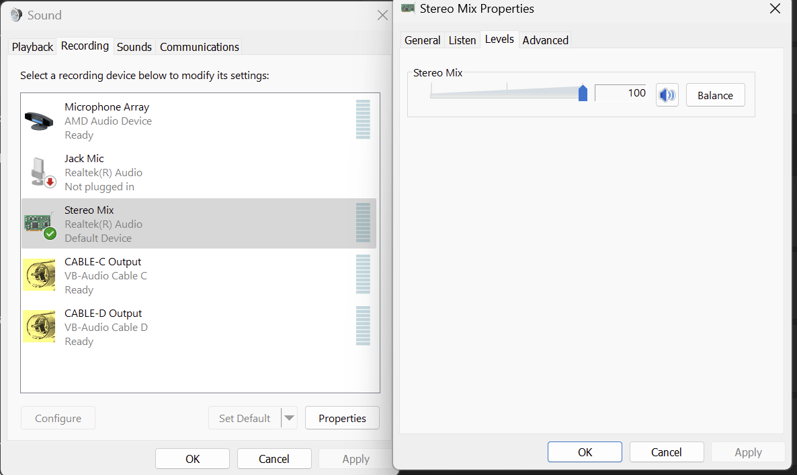
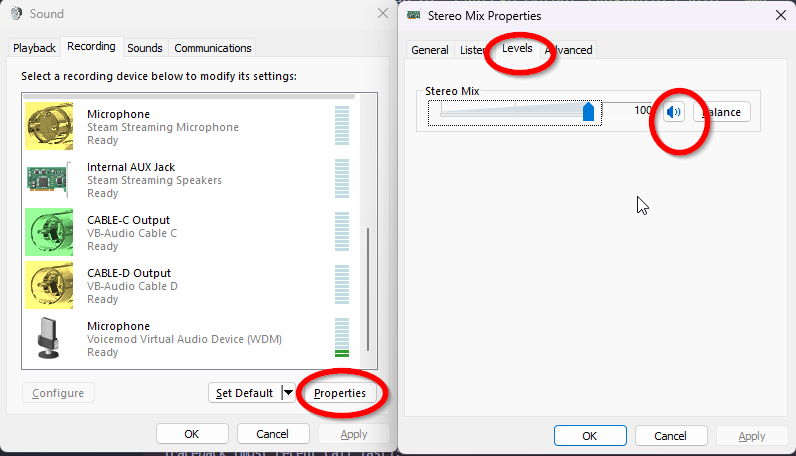

# ELLMA-T
An ECA that leverages an LLM (GPT-4) and situated learning framework for supporting learning English language in social VR (VRChat). 

[Arxiv](https://arxiv.org/abs/2410.02406)

## Prerequisites
1. Windows is recommended. Mac and Linux might work but no guarantees.
2. Recommended to use conda/venv
3. Install [Visual C++ Build Tools](https://visualstudio.microsoft.com/visual-cpp-build-tools/)
4. Install [Visual C++ Redistrubutable](https://learn.microsoft.com/en-us/cpp/windows/latest-supported-vc-redist?view=msvc-170#latest-microsoft-visual-c-redistributable-version)
4. Install [ffmpeg](https://ffmpeg.org/download.html)
    - `ffmpeg` in conda (and pip?) is just binaries, install `ffmpeg-python` (it is included in `requirements.txt`)
5. Install requirements with `pip install -r requirements.txt`
6. For VRChat simulation module, you will need 2 computers (for 2 instances of VRChat)

## Modules of ELLMA-T
There are two modules of ELLMA-T in this repo:

- *Text-based simulation (legacy)*: It is a command line interface that allows you to chat with the agent in a text-based environment, with limited audio speech to text support. It is recommended to use the text mode in VRChat simulation module.

- *VRChat simulation*: It is still a command line interface, but in addition to text based conversations,can be used in sync with VRChat to do TTS and STT.

## Running Text-based simulation module (legacy)
1. Get `.env` from TA and put it in `./textBasedSimulation`. This file includes the shared OpenAI key, MongoDB, and other API keys. Please keep this file private and DO NOT PUSH IT.

2. To run:
    ``` bash
      cd ./textBasedSimulation
      python ./textBasedSimulation.py
    ```

3. After each time program ends, CSV file is automatically generated about time usage will be generated In folder `textBasedSimulation/evaluations/TestScenarios_CSV`.

4. Our Agent is uses MongoDB as dataset to store memory and observations. You can connect to DB directly use connection string in `.env` file. Contact Teaching Assistant if you’d like to be added as admin of DB.

## VRChat Simulation Module - Text Only Mode
1. Put .env in `./SimulationSystem-VRCHAT`
2. To run:
    ``` bash
    cd ./SimulationSystem-VRCHAT
    python ./VRfinalVersion.py
    ```
3. Then select `1. Text Mode`
4. Follow the instructions in the terminal to set up character and conversation.

## VRChat Simulation Module - Audio Mode with 2 PC

### Setting up ELLMA-T avatar in VRChat
1. Enable stereo mix in your system. 
    - For Windows 10: Follow [this tutorial](https://softkeys.uk/blogs/blog/how-to-use-stereo-mix-windows-10)
    - For Windows 11: View [this YouTube guide](https://www.youtube.com/watch?v=1gkXTBv5GGE)
    - Pay attention on if the recording device is set to mute by default (Windows sometimes do this). 
2. Install [VBCable](https://vb-audio.com/Cable/index.html). If you are from Northeastern contact TA to get access to it.
3. Download VRChat from Steam and log in with your *VRChat account* (not Steam account).
4. In VRChat, press `R` to open menu, `Options` -> `OSC` -> `Enable`
5. In VRChat, press `Esc` to open menu, `Settings` -> `Microphone` -> `CABLE-C Output`
6. In VRChat, turn off background music. (Or even maybe all other sounds except player voices)

### Setting up audio devices
#### Using Stereo Mix
No need to do anything (this is the default setting).

#### Using CABLE-D
1. In `./SimulationSystem-VRCHAT/audioRecorder.py`, comment out `INPUT_DEVICE_INDEX = audio_device.get_vbcable_devices_info().stereo_mix.id` and uncomment `INPUT_DEVICE_INDEX = audio_device.get_vbcable_devices_info().cable_d_output.id`

#### Troubleshoot

### Running ELLMA-T
1. Log in to VRChat
2. Run:
    ``` bash
    cd ./SimulationSystem-VRCHAT
    python ./VRfinalVersion.py
    ```
3. Then select `2. Audio Mode`
4. Follow the instructions in the terminal to set up character and conversation.
5. ELLMA should say a greeting message in VRChat (you might want to use a mirror inside VRChat to check if the message is displayed also)

### Interacting with ELLMA-T
1. On another PC, log in to VRChat and navigate to the same world as ELLMA-T (headphones are recommended)
2. ELLMA-T will be able to pick up sounds from the VRChat (just like a normal player) and responds with audio.

### Troubleshooting
#### Echo and Loop
You can use either Stereo Mix or CABLE-D for capturing VRChat audio. When capturing VRChat audio, the volume must not be muted. This can introduce some issues of echo and loop in some setup (e.g. when you only have speakers). This is where CABLE-D can come in handy by pointing your audio output to a null sink (a virtual speaker that does not make any sound).

To use CABLE-D, use argument `python ./VRfinalVersion.py --use_cable_d`

#### ELLMA cannot listen to VRChat, or ELLMA speaks but no audio
Check windows audio device settings. Sometime the device can get muted.



## VRChat Simulation Module - Audio Mode with 1 PC
WIP

## Known Issues
- In VRChat Sim Audio mode, there will be multiple audio stream errors in the console, but it will not affect the audio playing.

## TODO
- [ ] Fix audio channel errors from OpenAI TTS response
- [ ] Audio mode with 1 PC?
- [ ] Clean up old code

## Changelog
- v0.2.0: 27/09/2024: Forked
- v0.2.1: 24/10/2024: Automated audio device selection for VRChat simulation module. Removed AWS Polly reference. Readme updated with instructions.
- v0.2.2: 24/10/2024: Fixed OpenAI TTS output stream error. Cable-D/Stereo Mix selection via command line argument.

## Citing ELLMA-T
```
@misc{https://doi.org/10.48550/arxiv.2410.02406,
  doi = {10.48550/ARXIV.2410.02406},
  url = {https://arxiv.org/abs/2410.02406},
  author = {Pan,  Mengxu and Kitson,  Alexandra and Wan,  Hongyu and Prpa,  Mirjana},
  keywords = {Human-Computer Interaction (cs.HC),  FOS: Computer and information sciences,  FOS: Computer and information sciences},
  title = {ELLMA-T: an Embodied LLM-agent for Supporting English Language Learning in Social VR},
  publisher = {arXiv},
  year = {2024},
  copyright = {Creative Commons Attribution 4.0 International}
}
```
